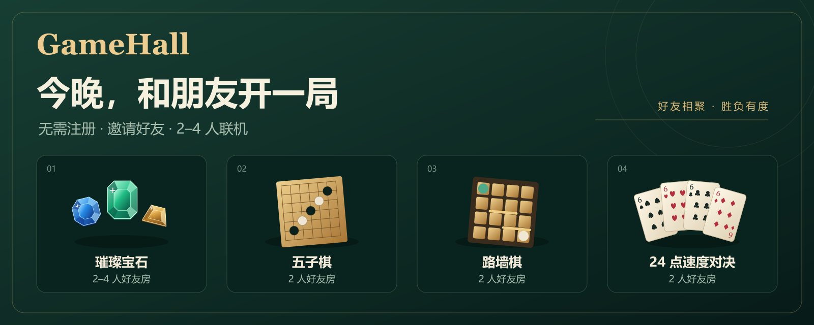

# GameHall



GameHall 是一个面向好友局的实时多人棋盘游戏平台。玩家使用昵称和六位邀请码创建私人房间，通过浏览器直接开始游戏；服务端负责房间生命周期、规则校验、状态持久化和实时广播。

当前提供五款可玩的游戏：

- 璀璨宝石：经典基础版，支持 2–4 人。
- 五子棋：15×15 棋盘，双人对局。
- 路墙棋：标准双人 9×9 棋盘。
- 24 点：限时双人速度对决。
- 德州扑克：标准无限注 2–4 人好友牌局，虚拟筹码跨手保留直至产生最终冠军。

## 核心能力

- 私人房间：通过邀请码或 `?room=XXXXXX` 分享链接加入。
- 服务端权威状态：回合、规则、胜负、版本和权限均在服务端校验。
- 可靠动作处理：使用 `actionId` 防止重复提交，使用 `expectedVersion` 拒绝过期状态上的操作。
- 持久化与恢复：SQLite WAL、外键、事务和版本化迁移；断线和服务重启具备有限恢复窗口。
- 多人房间：璀璨宝石和德州扑克支持四人座位、准备、开局、结算和房主重开；扑克单手结算期间房间仍保持活动状态，并通过幂等的 `readyNextHand` 动作汇集下一手确认。
- 房内消息：支持快捷表情和短文本消息，并持久化最近消息。
- 响应式界面：覆盖桌面、平板和手机布局；德州扑克提供非遮挡式逐手结算、实体筹码下注、质感卡牌与大厅发牌动效，并支持键盘操作和减少动画偏好。

## 技术架构

```text
浏览器 React/Vite
        │ HTTP + Socket.IO
        ▼
Express / Socket.IO 服务
        │ 房间、会话、动作、事务、广播
        ├── packages/game-core   纯函数游戏规则
        ├── packages/protocol    Zod 协议与共享类型
        └── SQLite                房间、成员、消息、动作回执与对局状态
```

仓库采用 pnpm workspace 管理：

```text
apps/web                 React + Vite 前端
apps/server              Express + Socket.IO 服务端
packages/game-core       五款游戏的规则引擎
packages/protocol        客户端与服务端共享的事件协议
docs/                    验证流程与项目文档
render.yaml              Render 单实例部署配置
```

`packages/game-core` 和服务端已接入标准德州扑克：2–4 人、1000 虚拟筹码、固定 10/20 盲注、公共牌、下注和主池/边池结算；一手结束后牌桌保留公共牌、摊牌牌型、最佳五张牌与底池归属，由未淘汰玩家共同确认下一手，筹码保留到仅剩一名玩家。

运行环境要求 Node.js `24.15+`、pnpm `11.19+`。

## 本地运行

```bash
corepack enable
pnpm install --frozen-lockfile
pnpm dev
```

启动后访问：

- Web：`http://127.0.0.1:5173`
- 服务健康检查：`http://127.0.0.1:3000/healthz`

Vite 会把 `/api` 和 `/socket.io` 代理到本地服务。首次启动时，服务端会创建 SQLite 数据库并执行缺失迁移。需要单独运行迁移时，在服务停止后执行：

```bash
pnpm migrate
```

## 验证

按改动范围选择定向检查：

```bash
pnpm verify:web       # 前端 lint、类型检查、测试和构建
pnpm verify:core      # 游戏规则核心 lint、类型检查、测试和构建
pnpm verify:server    # 服务端、数据库、Socket.IO 和集成测试
```

交付前运行完整门禁：

```bash
pnpm verify:full
```

完整门禁覆盖 lint、typecheck、单元测试、真实 HTTP/Socket.IO 集成测试、生产构建和负载冒烟。集成测试覆盖五款游戏、房间边界、重复与过期动作、断线恢复、重启恢复、房间消息、房主交接、多人牌桌、德州扑克跨手确认和整局终局，以及璀璨宝石/德州扑克重开；负载冒烟覆盖 50 个连接和 25 个活跃房间。

璀璨宝石的定向检查：

```bash
pnpm --filter @gamehall/game-core test -- splendor
pnpm --filter @gamehall/server test -- splendor-migration
pnpm --filter @gamehall/server test:integration -- splendor
pnpm --filter @gamehall/web test -- SplendorGame RoomPage
```

验证矩阵和失败处理流程见 [`docs/verification-workflow.md`](docs/verification-workflow.md)。

## 游戏规则范围

| 游戏 | 当前规则范围 |
| --- | --- |
| 璀璨宝石 | 90 张发展卡、10 张贵族、2–4 人供应设置、保留、购买、黄金支付、贵族选择、15 分终局与平局处理 |
| 五子棋 | 15×15、黑先、连续五子胜、无禁手、满盘和棋 |
| 路墙棋 | 双人 9×9、每人十墙、直跳与受阻斜跳、墙冲突校验、双方 BFS 通路校验 |
| 24 点 | A/J/Q/K 映射为 1/11/12/13，四牌各用一次，精确有理数计算，不执行 `eval`，每题 30 秒 |
| 德州扑克 | 2–4 人、1000 虚拟筹码、固定 10/20 盲注、无限注下注、公共牌、摊牌、主池/边池和同牌平分（奇数余数从庄家左侧分配）；筹码跨手保留，全体未淘汰玩家确认后发下一手，仅剩一名有筹码玩家时整局结束 |

围棋、关牌、炸金花、罗松和牛牛目前仅保留产品入口，尚未开放对局。

## 配置

| 变量 | 说明 | 默认值 |
| --- | --- | --- |
| `HOST` | HTTP 监听地址 | `0.0.0.0` |
| `PORT` | HTTP 端口 | `3000` |
| `DATABASE_PATH` | SQLite 数据库路径 | `./storage/gamehall.sqlite` |
| `PUBLIC_ORIGIN` | 对外访问源 | 本地为 `http://127.0.0.1:5173` |
| `ALLOWED_ORIGINS` | 允许的逗号分隔源 | 开发环境包含本地 Web 源 |

请从 [`.env.example`](.env.example) 开始配置。`.env`、SQLite 文件和 `storage/` 不应提交到仓库。

## 部署

项目提供 [`render.yaml`](render.yaml) 作为 Render 单实例 Web Service 配置。部署后可使用 `/healthz` 检查服务状态。

默认配置适合临时试玩：免费实例会休眠，SQLite 位于实例本地且没有持久磁盘，因此重启、休眠或重新部署可能清空游客、房间和对局数据。需要稳定保存数据时，应使用持久磁盘和单实例部署；如果未来需要横向扩容，应先将房间状态与动作回执迁移到可共享的数据服务。

## 设计边界

- 当前不包含账号系统、匹配、观战、排行榜、永久战绩、跨房私聊和支付能力。
- 免费部署不是高可用生产方案；实时连接、房间状态和 SQLite 数据库由同一个服务实例承载。
- 游戏状态由服务端生成并广播；客户端只提交动作，不直接决定规则结果。
- 对局快照只向玩家公开必要信息，璀璨宝石的保留牌等私有信息不会出现在其他玩家的视图中。
- 德州扑克手牌只向本人公开；摊牌时公开未弃牌玩家手牌，弃牌结束不公开其他玩家手牌。虚拟筹码仅在同一整局内跨手保留，不支持充值、提现或跨房间保存。

## 规则参考

璀璨宝石的基础规则参考[官方规则书](https://cdn.svc.asmodee.net/production-spacecowboys/uploads/2025/10/SCSPL01EN_SPLENDOR_RULES_LIGHT.pdf)，卡牌和贵族数据在测试中以仓库内的固定数据为准。
